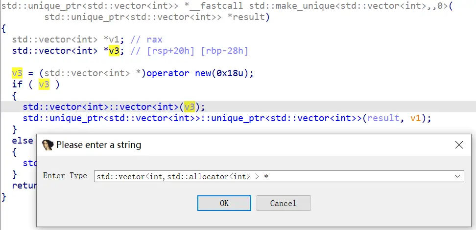
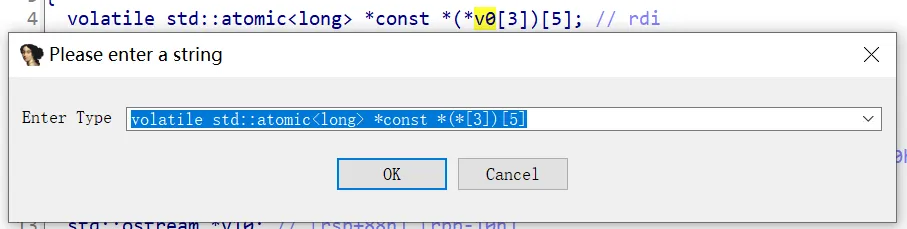

## IDA Zeta

一个 IDA 小插件，开发于 IDA SDK 9.1

## 功能

### 1. 设置带特殊字符的类型

对，就是模板。



快捷键：Shift+Y。

支持场景：

1. 局部变量。
2. 形参。
3. 全局变量。
4. 栈帧界面的栈变量。
5. 结构体成员。

支持多级指针嵌套的复杂类型，如：

```cpp
volatile std::atomic<long> *const *(*[3])[5]
```



不支持：

1. 函数类型。
2. 函数指针类型。
3. 包含以上类型的类型。

### 2. 闪退修复

修复伪代码界面编辑 extern 函数的类型时发生的崩溃。（并非彻底修复，但是能用）

## 参考

- [CustomTypeAssign](https://github.com/rigmar/CustomTypeAssign)
